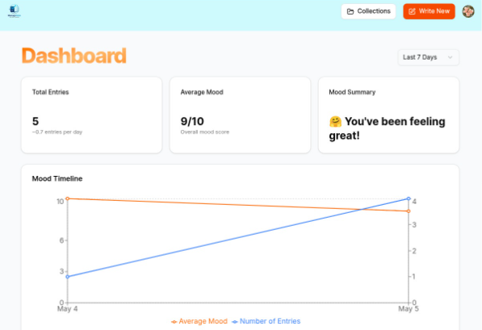
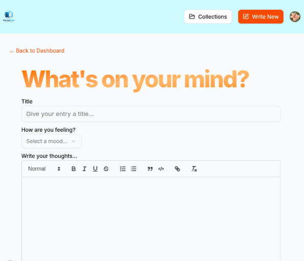
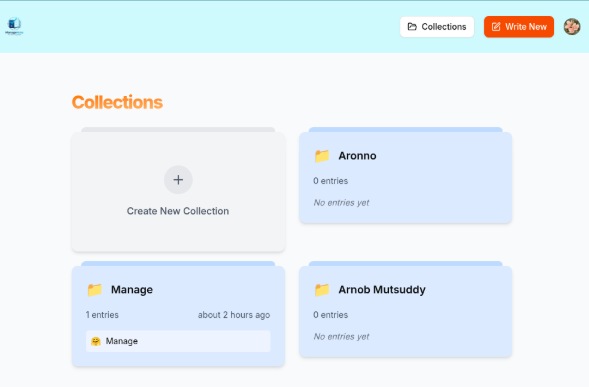

# ManageNote
Project for Software development - 01 course
# ManageNote 📝

A modern note management web application developed as a **university assignment for Software Development–01**.

ManageNote allows users to create, edit, organize, and manage their notes through a simple and modern web interface.

## 🌐 Live Demo

Coming Soon

## 📸 Screenshots
<p align="center">
    
</p>

### Dashboard

<p align="center">
    
</p>

### Note Editor

<p align="center">
    
</p>


### Notes Collection

<p align="center">
    
</p>

---

## ✨ Features

- 🔐 User authentication
- 📝 Create and manage notes
- ✏️ Edit notes
- 🗑️ Delete notes
- 📚 Organize notes
- 🖊️ Rich-text note editor
- 📊 Data visualization and analytics
- ✅ Form validation
- 📱 Responsive user interface
- 🔒 Secure user management

---

## 🛠️ Technologies Used

### Frontend

- Next.js
- React
- JavaScript
- Tailwind CSS

### Backend & Database

- Prisma ORM
- PostgreSQL

### Authentication

- Clerk

### Other Libraries

- React Hook Form
- Zod
- React Quill
- Recharts
- Lucide React

---

## 📂 Project Structure

```text
ManageNote/
│
├── app/
├── components/
├── lib/
├── prisma/
├── public/
├── package.json
├── next.config.js
└── README.md
